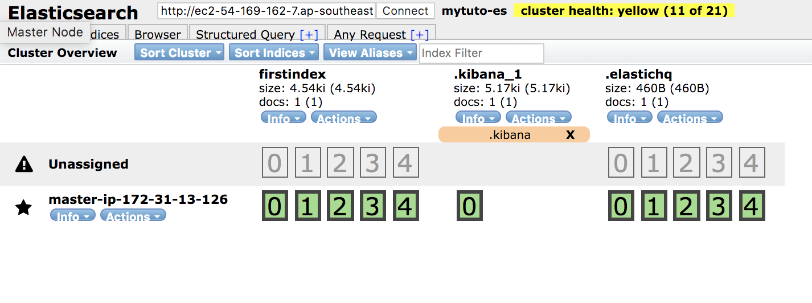

# ES-Tutorial-2

ElasticSearch 두 번째 튜토리얼을 기술합니다.

본 스크립트는 외부 공인망을 기준으로 작성되었습니다.

## ElasticSearch Plugin 설치

이 튜토리얼에서는 rpm 파일을 이용하여 실습합니다.

```bash
[ec2-user@ip-xxx-xxx-xxx-xxx ~]$ sudo yum -y install git

[ec2-user@ip-xxx-xxx-xxx-xxx ~]$ git clone https://github.com/benjamin-btn/ES-Tutorial-2.git

[ec2-user@ip-xxx-xxx-xxx-xxx ~]$ cd ES-Tutorial-2

[ec2-user@ip-xxx-xxx-xxx-xxx ES-Tutorial-2]$ ./tuto2
##################### Menu ##############
 $ ./tuto2 [Command]
#####################%%%%%%##############
         1 : install head plugin
         2 : start head plugin
         3 : install hq plugin
         4 : start hq plugin
#########################################

```

## ELK Tutorial 2 - Head / HQ Plugin 설치 및 시작

### Head Plugin
* ElasticSearch 클러스터의 노드, 인덱스, 샤드 등을 한 눈에 볼 수 있는 플러그인
* 2.x 버전까지는 내부 빌트인 플러그인 형태로 존재했으니 5.x 버전부터 standalone 형태로 변경됨
* 9100 포트로 실행됨

```bash
[ec2-user@ip-xxx-xxx-xxx-xxx ES-Tutorial-2]$ ./tuto2 1

[ec2-user@ip-xxx-xxx-xxx-xxx ES-Tutorial-2]$ ./tuto2 2

```


### HQ Plugin
* 클러스터의 노드나 상세 상태정보 값을 모니터링 할 수 있는 플러그인
* Head Plugin 과 마찬가지로 2.x 버전까지는 내부 빌트인 플러그인 형태로 존재했으니 5.x 버전부터 standalone 형태로 변경됨
* 5000 포트로 실행됨

```bash
[ec2-user@ip-xxx-xxx-xxx-xxx ES-Tutorial-2]$ ./tuto2 3

[ec2-user@ip-xxx-xxx-xxx-xxx ES-Tutorial-2]$ ./tuto2 4

```

## Smoke Test

### Head Plugin

* Web Browser 에 [http://{Head Plugin 설치한 장비의 FQDN}:9100/index.html?base_uri=http://{ES Cluster FQDN}:9200 실행](http://HeadPluginFQDN:9100/index.html?base_uri=http://ESClusterFQDN:9200)




### HQ Plugin
* Web Browser 에 http://{FQDN}:5000 실행
* Web Browser 에 [http://{HQ Plugin 설치한 장비의 FQDN}:5000 실행](http://HQPluginFQDN:5000)


